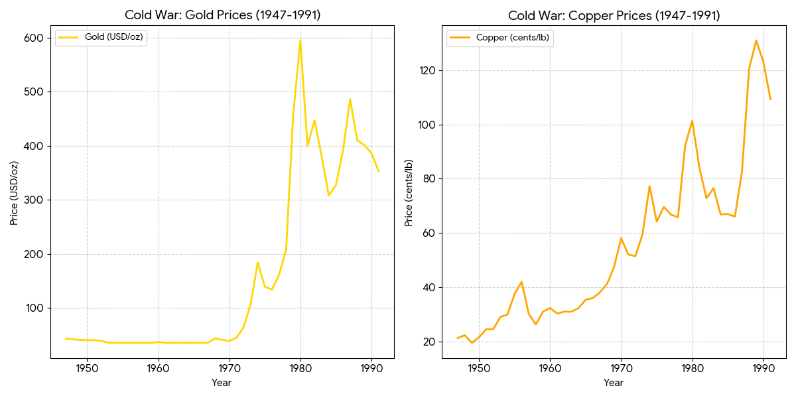
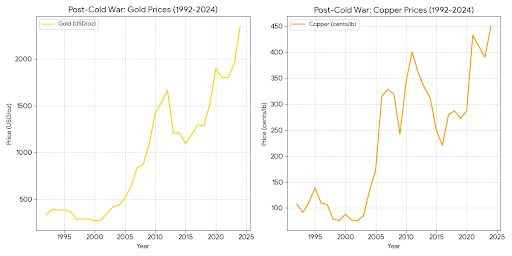
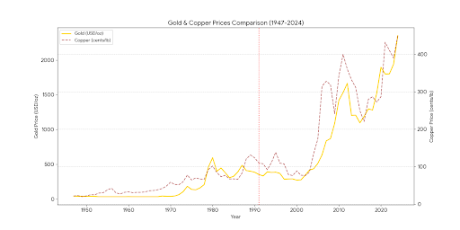

# 战争金属及新冷战

## 核心观点

当前金属价格异常上涨的主因并非单一的科技需求, 还有地缘政治下的"战争预期"与战略储备需求.

* **美苏冷战前后"战争金属"价格波动逻辑**: **美苏进入意识形态对抗与军备竞赛巅峰, 双方大规模战略囤积, 相互贸易禁运、代理人战争--供应不稳定&恐慌性购买, 导致价格暴涨暴跌**; 冷战缓和后, 即使半导体、计算机、信息技术高速发展20年, 价格仍持续回落20年.

* **历史类比**: **当前与1970~1980年代高度相似, 全要素生产率停滞、全球化逆转、右翼化加剧、地缘政治紧张、大国对抗博弈、新生产力萌芽**.

* **中美新冷战模式**: **美国构建战略库存&地缘政治冲突导致供应不稳定, 引发金属价格异**. 实际上中国也在做同样的事情.

* **现状评估**: 决策层短期(四、五年)无明显变化迹象, 因此新冷战结束为时尚早, 金属价格受战争预期主导的异常状态仍将持续.

* **结束迹象**: 类似"里根-戈尔巴乔夫会面"的时刻--双方领导人承认共存、消除对抗因子; **此时刻出现后, 不仅双重属性金属, 诸多资产走势可能彻底逆转(战略需求消退->库存释放->价格回落)**.

## 核心趋势分析

### 冷战时期(1947~1991): 从"金本位"到"大通胀"

*图表-1: 冷战期间黄金从固定汇率到1980年暴涨的过程*

* **黄金**: 固定期(1947-1971): 在布雷顿森林体系下, 黄金价格被严格锁定在每盎司 $35 美元。这一时期的金价曲线几乎是一条直线.

    * 剧烈波动期(1971-1980): 1971年尼克松冲击导致美元与黄金脱钩. 随后在1979年苏联入侵阿富汗、伊朗人质危机及美国高通胀的驱动下, 黄金作为避险资产在1980年初飙升至历史高位(年均价接近600刀，盘中曾触及850刀)。

* **铜**: 铜作为工业命脉, 其价格在冷战前期随战后重建相对稳健. 但在20世纪70年代的滞胀危机和石油危机期间, 由于生产成本上升和货币贬值, 铜价出现了显著上涨. 

### 冷战结束后(1992~至今): 全球化与商品超级周期

*图表-2:21世纪以来黄金和铜价的同步上涨趋势*

* **黄金**: 1990年代被称为黄金"被遗忘的十年", 金价长期在300~400刀徘徊. 然而, 2001年"9·11"事件后, 随着反恐战争、2008年金融危机以及近年来的地缘政治冲突(如俄乌冲突)和全球通胀, 黄金再次走上长期牛市, 2024年已突破每盎司2400刀.

* **铜**: 2004年起, 铜价进入了由中国城镇化和工业化驱动的"大宗商品超级周期". 铜价从冷战末期的每磅约1刀左右, 跃升至如今的每磅4~5刀美元. 近年来, 能源转型(电动汽车和绿电)进一步支撑了铜的需求.

*图标-3: 1971年和2004年两个关键转折点*

## 历史与经济总结

从数据上看, 黄金是 **"政治的晴雨表", 其每一次剧烈波动都对应着大国博弈或货币秩序的动荡; 而铜则是"经济的敲门砖"**, 其走势完美契合了全球工业重心从西方转向东方的历史进程.

## PS
战争金属: 铬锰钨钛钽铀银锡等~