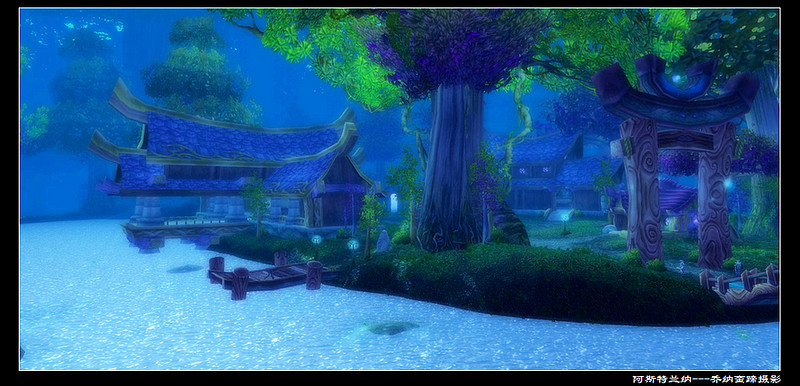

# 小说 （碧空之歌）（魔兽小说）

> URL: https://xueqiu.com/4327270746/108592699

来源：雪球App，作者： 为霜，（https://xueqiu.com/4327270746/108592699）
“我的爱人，您不要走，请您放缓您的脚步，不要离开我们！”
我在内心竭力的呼喊着.但是，他，我前面这个瘦小的身影， 在奥格瑞玛城门外渐行渐远，最后只看见他腰间挂着的那把发着蓝光的碧空剑，在夕阳反射下化成的一点耀眼光芒.....这次他是真的要永远离开我们了.我的眼泪忍不住夺眶而出. 命运为什么要对善良的人如此的残忍，为什么要让他的一生都活在痛苦的回忆和无尽的放逐中..
我是一个祭祀，在我出生的那段时期，部落和联盟的战争阴霾 笼罩了整个艾泽拉丝大陆， 战争 让我成为了孤儿，是部落伟大的女祭祀  收养了我 并且教育了我 如何生存. 
我永远不能忘记 我第一次遇见他. 那是在多年前 我还是一个14岁的小姑娘，为了追逐一头受伤的黑角鹿 撞入了美丽的灰谷。当时 我被夜歌森林梦幻一般的景色深深的吸引， 探索着进入了森林深处，，在一个梦一样的月亮井边 听着缥缈的歌声。我痴迷了，忘记了危险，兴奋的用那圣洁的水 在梳理我柔软的头发.. 突然，一股腥味 涌入了我的鼻孔，我腾然抬头  一头银灰色的巨狼 正张开血盆大嘴 向我 扑了过来. 我吓坏了，闪电链，治疗波，地肤图腾..手忙脚乱的吟唱着各种半生不熟的魔法，但是 片刻间 我已经伤痕累累，正当我绝望的闭上眼睛的时候，耳边 响起来了一把冰冷的魔法吟唱声音，“恶魔之魂，毁灭之力，死亡的阴影，缠绕着这个罪恶的灵魂把.” 我在睁开眼睛的时候，巨狼 仿佛中了某种魔咒 惊恐的 向后面逃窜， 而在我对面的阴暗出 缓缓亮起了一道蓝色的光芒，那头逃跑的灰狼也慢慢的倒下...那一霎，幽暗的夜歌森林仿佛突然间变成了另外一个世界  晴空万里，一碧如洗，。
.  “这不是你该来的地方，我可爱的小祭祀。” 那把冰冷的声音 伴随着一个消瘦的身躯， 在月亮井旁边的阴暗出缓缓的移出.是一个遗忘者，我在奥城看过他们.“刚才是您救了我吗？先生。” “我送你回去把，你是在奥格瑞玛跑来的把，”..劫 后 重 生的欢快让我在回家的路上 心情格外轻松雀跃..“请问，刚才发出蓝光的是一把宝剑吗？我可以看看吗？” 他默默的看了我一眼，顺手就把腰间的那把剑摘给了我。这是一把外表很平凡的剑，古朴的沉木剑鞘，暗灰色的剑柄，除了剑身 被一层蓝色的荧光包绕外 几乎是一把很平凡的剑.“他有名字吗？”“他叫碧空之歌”，“为什么叫碧空之歌？”他停下了脚步，回头用空洞的眼睛看了看我，然后继续的默默向前，“我有个朋友说，世界上有一种力量，他带给世间的 不是毁灭 而是希望，是一种抵抗压迫 扫荡阴霾的力量，他所触及的是雨过天晴，碧空如洗， 碧空之歌，是一把希望之剑。 是 自由，美，和平的 守护者。”“小祭祀，你有公会吗？”“什么是公会？ ” 我好奇问到。“公会，就是一个 有着共同信仰的人，为了一个共同的目标而聚集在一起的大家庭”“我没有公会，我可以加入你的公会吗？” 从此，我加入了一个希望的公会，我也爱上了一个叫MOON的术士.....
时间在艾泽拉丝大陆永不停止的流逝着，我也由一个懵懂的小巨魔成长为了一名撒满祭祀，跟随着公会为了我们共同的信仰 在这片战火摧残的大陆中抗争着.我们一同征讨过野心勃勃的黑龙军团，挽救过被堕落的绿龙军团，在黑石山深渊 打败了炎魔，也尝试着阻值上古之神克苏恩的野心. 他，每次总是出现在最危险的地方，用那把碧空之歌，吟唱着各种奇怪的魔法 召唤出各种深渊的恶魔，一个接一个强大的敌人在我们面前倒下了.但是，无论我们取得多么大的成功和胜利，我从来没有看见过他灿烂的笑，他总是那么落寞憔悴，郁郁寡欢，唯一的消遣 就是 在奥城的 大歌剧院 倾听 柴可夫的提琴曲《如歌行板》.每次，我问会长－－部落最出色的大法师，也是他最好的朋友时，会长总是会心微笑的拍拍我的肩膀，美丽的祭祀，他总有一天会灿烂的笑的。
注定今天是一个悲伤的日子，如果不是我在尘泥沼泽挽救了那个垂死的联盟卫兵，如果不是我把那个可怕的消息带给了他 ....当我告诉了他  暴风城的国王 可能被困在那个魔鬼出没的奥卡兹岛的时候，他向来空洞的眼睛突然闪烁起了一种我从来没有看见过的光芒，苍白的手突然紧紧的握住了他腰间的那把碧空之歌，一条条青筋在他干枯的手背上凸现出来.一种深入骨髓的寒冷在我心灵涌起，“回奥城，如果2天后我没有回来，把消息告诉7山，现在什么也不要说，回奥城 等我。”说玩，他就召唤出了那匹火红色的梦魇，转眼间 就消失在了贫瘠之地。“亲爱的，你究竟想干什么，你要一个人去那个 魔鬼出没的奥卡兹岛吗？不要，我求你不要去，我现在就去告诉会长，我马上去。”.......
“注定今天是一个悲伤的日子，我可怜的莱恩国王。你的手下出卖了你，虽然你逃到了这里，可惜吉安娜 依然不能挽救你罪恶的灵魂，来把，以恶魔的名义，牺牲你的肉体，洗涤你的灵魂把。”“哈哈哈，遗忘者，你弄错了，今天，我的确是要面对死亡，，只是可惜了不能把普瑞斯托的阴谋告诉我的兄弟，来，遗忘者，我用我的生命做交换，请你刺杀我之后，把这个可悲的消息告诉暴风城的伯瓦尔公爵 让他洞察黑龙公主的阴谋 让我的人民免除死亡的威胁.”“死亡，这是一个多么熟悉的名字，难道只有你的臣民的生命才是珍贵的，而我们部落的生命就是卑微的吗？如果不是你发动了一次又一次的对部落的战争，我们会有这么多灾难吗？而我心爱的蓓丝 会这样永远的离开我吗？” “不要废话了，接受死亡的降临把！！”“恶魔之名，毁灭之力，暗影风暴，带走这个罪恶的灵魂把”...“奥术的光辉，宁静的晨曦，让这颗困扰的心 沉默把。”.......
“7山，你为什么要阻止我？”他回头向我们看来，锋利的眼光在我的脸庞扫过，我咯噔的 退了一步，低着头，在也不敢看他，低声说到“我是怕你出事。”“moon, 国王不能杀，”“不能杀？那么我亲爱的蓓丝难道就应该死吗？难道你不知道她是怎么离开我们的吗？”“如果暴风的国王死在了这里，那么这个世界将再次陷入混乱，部落 联盟辛辛苦苦刚结下的脆弱同盟，就会因此而土崩瓦解，那么将会有更多的蓓丝会离开她的爱人，MOON。”“果然是好心肠，果然是神的儿女，只可惜，在蓓丝离开我的那刻，我的灵魂已经出卖给了恶魔，在我的内心，只有复仇的怒火，今天 谁也不能阻拦我。”“恶魔的名义，痛苦的灵魂，恐惧的黑暗，带走我面前这颗困扰的心灵把。”“亡灵的种族，坚定的意志，请帮我抵御这恐惧的降临把。 ”“恶魔的名义，痛苦的灵魂，死亡嚎叫，带走我面前的困扰者”“部落的力量，徽记的光芒，请帮我驱逐着恐惧的来临”.“7山，你不要在逼我，我不想伤害你。”“我是为了全部的联盟和部落才这样做的MOON, 复仇的火焰已经蒙蔽了你善良的内心，但愿奥术的光辉能唤醒你沉睡的内心。moon 在奥术的指引下 变为我驯服的绵羊把。”“哈 哈哈，我用生命做契约，地狱的恶魔，苏醒把，吞噬束缚我的魔法 沉默把.可笑的奥术我用恶魔的名义，牺牲痛苦的灵魂，暗影的力量 腐蚀黑暗的大地，夜幕，降临把。” “不要，MOON你们不要打了 不要伤害会长！”我撕心的叫着，扑向了 受伤的会长，“带他离开，我马上就回来。”“现在，没有任何东西可以阻止我 复仇的火焰在我胸中 熊熊燃烧，我用生命做契约，用恶魔的名义，痛苦的灵魂，毁灭的力量 在我手上跳动把，灵魂碎片点燃把， 地狱的灵魂之火，穿越这个郐子手肮脏的身体。”“不要 moon, 奥术的光辉 闪烁的灵魂，给我最后的力量，闪现把 让我的身体抵挡这厄运的降临。。”“不要啊，”“闪开，7山，你.........” “轰，......。
为什么，为什么？我最亲密的战友，我最尊敬的伙伴，为什么你要这样做？”“亲爱的moon，还记得我送你的这把碧空剑吗？ 世间上，有一种力量，不是毁灭，而是希望。用你的力量 洗涤这痛苦的大地，暴雨阴霾，最终都会在这种力量下变得碧空如洗，晴空万里， 用我的牺牲 平息你复仇的火焰，让你内心换来永远的宁静......
“moon，不要走，我们回奥城， 歌剧《春》，今晚就要放演，” 陪我。我好冷.
“云，你已经长大了，今后还有很多的事情要你面对，我要走了， 我会选择我自己的生活。”
“别了，公会，别了，我心爱的奥格瑞玛.”
走了，一切又恢复得那么的平静. 7山会长永远的离开了我们。而暴风的国王顺利的回到了联盟，黑龙军团的阴谋也瓦解了，而他，却在也没有出现在我们面前.  很多年过去了， 有人听说，在极北苦寒的新特兰 住着一个亡灵术士，每次 当天灾亡灵入侵的时候，他总会骑着一匹红色的梦魇，穿越毒蜘蛛峡谷，在瘟疫最严重的 地区，和天灾斗争，挽救了一个又一个破碎的家庭，他总是那么的沉默，而他手上 拿着的是一把 有着可怕而又神秘魔法的宝剑。在长空中，微微的发着蓝色光芒。

$兴业银行(SH601166)$ $格力电器(SZ000651)$ $中国中车(SH601766)$