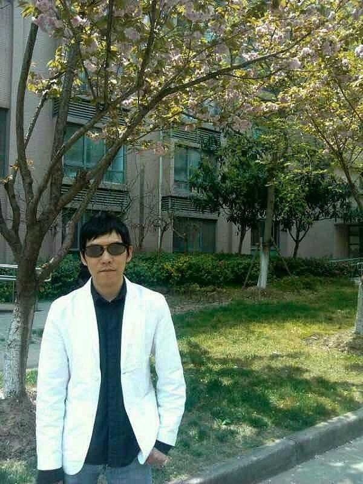
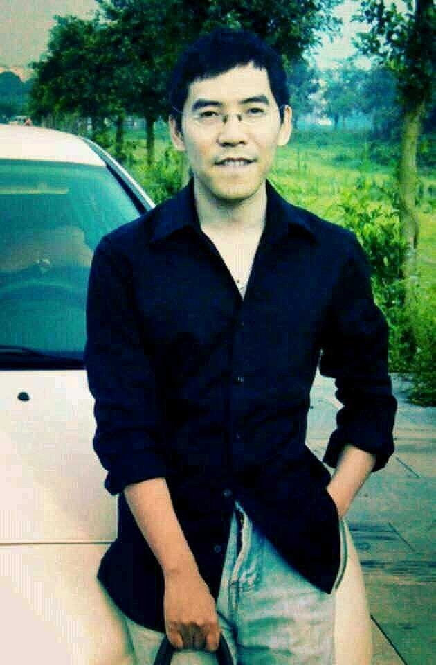
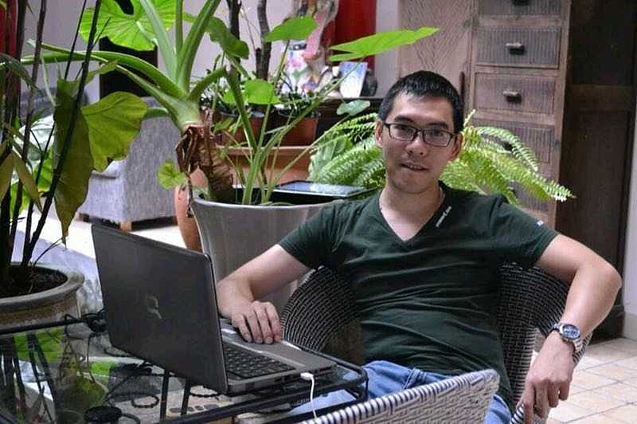
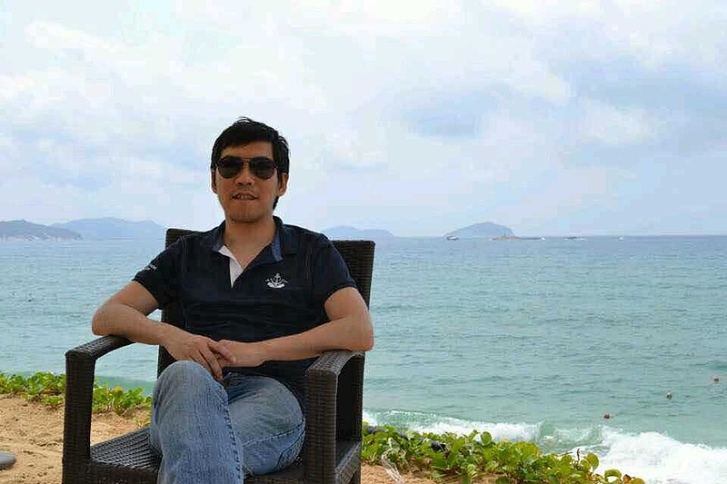

# 十年一觉扬州梦

> URL: https://xueqiu.com/4327270746/318924440

来源：雪球App，作者： 为霜，（https://xueqiu.com/4327270746/318924440）
我是2014年，上一轮大牛市开始炒股的，到今年刚好是十年。十年，白驹过隙，一晃而过，仿佛就在昨天......
其实我开户的时间还要更早一些，在2010年。那是有个师姐在民生银行有个任务考核，请我帮忙开一个广州证券的账户，要求绑定在民生银行。于是，我也就有了这个证券账户，一直沿用到今天。
我的父母都是那种老一辈很传统的人，他们一直认为中国的股市就是赌场。耳濡目染下，那时的我对于股市也是有一种天然的反感与抗拒。所以，就算开了账户，也一直都没有动，直到2014年又一轮大牛市的到来。
对于太晚接触股市这件事情，其实我是一直比较遗憾的，如果我能早十年接触股市，或者我现在的人生也会不同。而他们的生活或者也会大为不同。人都是要为自己的认知埋单的，历史没有如果，股市也没有。
先说说第一个五年：
虽然我接触股市很晚，但是对经济却不陌生。而随着对市场经济的更深入了解，踏入股市应该是水到渠成的事情，差的只是一个契机。而这个契机就发生在2014年，那年的大牛市。我记得当时我是充了10万块钱，然后开了融资，那时候开融资没有限额的，多少钱都可以开。满仓满融买入了炒股以来真正意义的第一支股票，广发证券（实际第一支股票是开户时候5000块买的民生银行）。很快就翻倍赚了10万。这也是我人生炒股以来赚的第一个十万块钱。
接下来的事情大家也知道了，就是股票崩盘，融资盘踩踏，我不仅把10万块的盈利全部回吐，还差点把本金十万块也被强行平仓了。还好当时我没有太贪心，保持了一点清明，没有在广发高位继续融资。否则就是真的爆仓了。而那一次让我对融资有了极其深刻的畏惧与触痛，我曾经以为我再也不会用融资了，而实际上，后面用融资更狠......不过，对于融资的敬畏是一直存在的，这应该也要归功于那次被伤得那么深。所以老辈们说爆仓要早，其实很有道理的。爆过一次后，有了敬畏，但同时也打了免疫。
由此以后，痛定思痛，就把生活上主要精力都用在学习与实践炒股的道路上了。那段时间自己好像魔怔了一般，凡是有关股票股市的电视节目，娱乐节目，书籍，报道等等都反复观摩，爱不释手……我好像是2017年来雪球的，当时经过几年的沉淀，感觉自己又行了。感觉几万块炒股没意思。寻思着供给端去产能与金融去杠杠杆应该差不多了，于是就在场外搞了100万，结合自己之前炒股的一些积累，大概100多万，在港股与A股两头配，也就有了后来在雪球的实盘。后来，港股那边不玩了，把钱拿出来还了一些场外杠杆，就剩下A股雪球这里一个账户了。
第二个五年
在2019年末，我用100万在雪球开了这个实盘记录（雪球置顶帖，每月都有实盘记录），到今年也刚好5年。如今100万本金滚到了最高500多万。刚好5年5倍。期间一共提取了115万，而今年又充值了110万。资金进出为-5万。
而我原来开户的广州证券也在2020年被中信证券收购了，成为了中信广州的分公司。而因此中信也只能提供2019年以来的账户记录。这个记录显示在2019年，我的本金是70万，期间充值190万，提取了190万。而到今年450万算。那6年也翻6倍多了。
现在看，如果脱离了资金进出谈收益，其实是没什么意义的。在更早开户的时候，我就充值了5000块钱，买入的第一支股票是民生银行。如果按照雪球那些表格股神的计算方式，我5000块滚到500万，15年收益是1000倍。所以方老板有句话说得好：没有经过第三方证明的吹嘘都是耍流氓。其实也正是这句话才让5年前的我要执意在雪球开实盘的最重要原因。原因可能就是年少轻狂，一定要证明自己吧。没有实盘谈收益，或者未必都是假的，只是水分有多少就很难说了。就比如我刚开始，说是十万块钱起步，其实有一百万的场外杠杆注入。
现在我对这些也看得很开了，有心借鉴一二，但没有实盘的就算了，你不知道他说的是真实感悟还是纸上谈兵的臆想。就比如我自己在初期阶段，就深受中国巴菲特思想毒害，这些在20年的雪球总结里都有记录。现在回头看，中国的巴菲特们，除了炒股不行，什么都行。理论是一套一套的，说得他自己都信以为真，除了没钱，差点都能教育巴菲特怎么炒股票了……而对于一些私募基金，其实他们也有自己的难处，用别人的钱肯定是不如用自己的钱方便的，为了应对更多的不确定性，负责任的私募肯定都会留有余地的。所以，在理论上，做私募基金除了能收管理费，让自己的实际收益更高一些外，对于业绩，肯定是不如单干的好。所以，现在对于能不能跑赢私募我也没什么兴致了。
回顾过去5年，上证指数涨幅基本为0。市场不容易，跌宕起伏，固然有很多机会，但内外部各种风险变化实在也太多。我认为过去五年最大的机会是科技应用的崛起与加速，由光伏到电池到电动车到半导体到目前的AI是贯彻整个5年的科技主线，这里催生了很多时代性的机会，比如下跌前的隆基股份，宁德时代，比亚迪以及现在很多科技股，塞力斯，寒武纪等等都是在市场张目结舌当中翻倍后又翻倍。而美股特斯拉更离谱，翻几十倍，而英伟达这种巨无霸也有十倍左右的涨幅，而且目前还没有看到成长动能的衰竭；而最大的风险来自中美两国国力的变化，带动了地缘政治国际关系国家利益等生产关系的重构。这给投资带来了非常严重的不确定性。而对于目前国内新旧生产力转换产生的暂时困难，我觉得不是风险，反而是机会。
而我自己能在这段期间成长，成熟，并且还能取得当下这个成绩，一半算是运气好，一半应该也要归结自己的学习能力与适应能力比较强，能在每次逆境中快速学习成长，并且摆脱困境步步登高。而另外一个也很重要的原因，我觉得就是人生观的成熟与世界观的认知深度。同时有坚定的信仰与足够的勇气。这两点对于我能在过去三年走出阴霾也有不可估量的重大作用。信仰，勇气，智慧，这三者是构成投资者内在三个最重要支点。它们是你炒股内在架构的基础。而由几何学来说，三角形也是最稳定的结构。信仰，勇气与智慧必须在一个非常巧妙的平衡当中。过分信仰就是盲目，过分勇敢就是冲动，过分智慧就是聪明过头，都是过犹不及。要做到三者的强大而且平衡，这一点非常难，你必须坚持该坚持的，放弃该放弃，在勇敢的时候要勇敢，在谨慎的时候要谨慎，这些都需要智慧来衡量与判断。这真的很难很难......
在过去五年，对我影响最深刻的应该是2022年，亏了42%。也是这一年的重大亏损，才让我成长为今天的自己。现在的我回头看，如果当初我有今天的认知与心境，那5年应该不止翻5倍，现在可能已经能到A8了。我之前就对炒股做过分类，在股市有三重境界，第一重是“靠运气赚钱，靠实力亏钱。”而在2024年之前的我，不能说完全靠运气，但运气的成分肯定是更高一些。第二重是“靠实力赚钱，靠运气亏钱。”现在的我，自认为已经到了这层。只要运气不是太差，一直赚钱是大概率的事情。而第三重“永远不会亏钱，并且还能高效率的赚钱”。这一层的境界我还没有达到，也说不出什么来。可能巴菲特就是这一层的。在雪球最热门的话题，什么时候可以全职炒股。我觉得不能单看资金量的多少，而是要看自己炒股的能力与家庭抗风险的能力。一般到了第二层境界靠实力赚钱，靠运气亏钱，那你应该就可以全职做了。只是人类都有迷之自信，尤其对于炒股的人。明明靠运气赚钱，偏偏觉得自己是靠实力。认识别人容易，认识自己并且能坦诚面对其实更不容易。
作为一个过来人回头看，我觉得对于每个刚入门的人，每5年都是投资的一道坎，5年前的自己与5年后的自己，要做到判若两人，否则要么你是不上心，不想也不喜欢在这一行业发展；要么你就是天赋根基非常差。当然还有一种，你就是天才，生而知之。但这种可能性几乎是0，我就是生而知之的人，但我也不认为，我一踏入股市就能一帆风顺，一直赚钱。
除了本金，我觉得前面十年更重要的是自己内在的人生观，价值观，世界观，决心，勇气，眼光，信心，经验等等的积累。我把这些统统称为是一个人的交易系统的成型与成熟。而一个人的交易体系要成熟，就我个人而言，需要2个5年。
现在的我在回顾5年前刚入雪球的自己，是少了很多激情与幻想，多了一些沉稳与平淡。具体说就是懂得了如何放弃与如何空仓。游资有一句话：不懂空仓的资金是永远做不大的。对于一个坚定看多的人，要他空仓是非常困难的，也就是你在战略看多的同时，必须要有能力把握住阶段性的局部做空机会。永远满仓的人，要不就是运气特别好，要不就是眼光特别好。否则长远看，收益率也就泯灭于众人矣。你们看巴菲特，如果不是在几次关键节点空出大量资金，按照他那个体量的资产肯定是不可能把收益率做到15%以上的。你们再看看我们雪球几位价值投资大师，他们的基金成立时间也不短了，看看他们的收益率与全球各大股票指数比较一下就有答案了。炒股这件事情，你强不强，说得天花乱坠没用，看成绩就一目了然。这难不难呢？当然非常困难。
这几年，感觉自己每年都过得特别辛苦，战战兢兢，如履薄冰。每年的年终总结总感觉自己筚路蓝缕，一路艰辛。但是回头望十年前，那时候我真的就只有10万块。而现在最高的时候都有500多万了。收益应该算非常巨大了。所以巴菲特有句话说，人总是过分看重短期的影响，又太过忽略长期的影响。所以短期其实真的也没必要过分看重。而更应该看重持续性的正收益。滚雪球应该就是属于长期影响了。
过去的点滴都记录在雪球当中，现在总结其实也没什么好说的，除了感叹一下时光的匆匆，似乎也就是如此了。对于目前500万的本金体量已经不算是一个小数目了，作为人生的仪式感，25年元旦，对于过去十年做一个回顾，既是留念总结，毕竟十年也算是人生一大段的时光，无论好坏得失，为了忘却的纪念；同时也为下一阶段做准备，至少在心态上要完全放松与回归，要更专注面对未来的不确定性。也希望未来十年能取得一个更好的收益，毕竟100万与1000万，在中国股市当中其实是没什么区别的。
无论男人还是女人，其实花期都是很短的。如果不能一直保持巅峰，所谓曾经辉煌，过气巅峰是没有任何意义的，反而徒增伤感。人一旦过了35岁，颜值与肉体是肯定不可避免的走下坡的，这个时候如果没有精神上的增量来弥补肉体的不断滑落，人的失落感会越来越严重。所以你们看很多老人，到了晚年都会迷恋玄学佛学等等，所谓逃禅逃禅，逃的其实就是肉体的减量。而炒股的好处就是可以让你一直保持在巅峰一直用物质的增量来弥补你肉体的减量，比如巴菲特，90多岁了，依然还有自己的生活。这也是我向往的生活。
人生就好像是一趟红眼航班，刚登机的时候以为要飞很久，而上机后才发现，不过是在座椅上眯了一会眼，就又要准备降落了。十年，看似很久，实际上不过仅仅是一场梦的时间。
十年一觉扬州梦......

