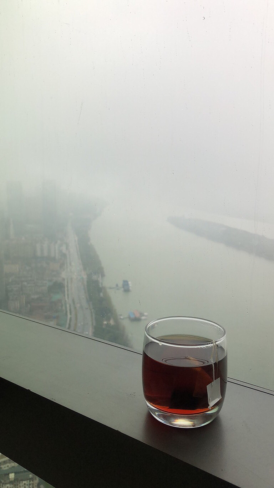

# 潇湘夜雨

> URL: https://xueqiu.com/4327270746/163933576

来源：雪球App，作者： 为霜，（https://xueqiu.com/4327270746/163933576）
昨夜潇湘又是一场秋雨，让我的睡眠很不好。清晨醒来，一杯红茶，远眺湘江一片朦胧，感慨油然而起。自古以来，潇湘夜雨就一直被文人墨客所传吟，是乡愁，也是对人生的无奈。
南宋有一位词人叫蒋捷，前后写过两首很著名的听雨词，年轻的时候写的是《一剪梅.舟过吴江》：
一片春愁待酒浇，江上舟摇，楼上帘招，秋娘度与泰娘桥，风又飘飘，雨又萧萧。何日归家洗客袍。银字笙调，心字香烧，流光容易把人抛，红了樱桃，绿了芭蕉。
很明显，这种就是辛弃疾说的，为赋新词强说愁。表面看一片春愁，而字里行间全是生命中动人的故事，什么江上舟摇，楼上帘招，秋娘度与泰娘桥，什么红了樱桃 绿了芭蕉。这些全是生命中的闪光。只是因为美好短暂，所以才有了愁。实际就是幸福的烦恼罢了。
而后，人到暮年，他又写了一首《虞美人.听雨》：
少年听雨歌楼上，红烛昏罗帐，壮年听雨客舟中，江阔云低，断雁叫西风；而今听雨僧庐下，鬓已星星也，悲欢离合总无情，一任阶前，点滴到天明。
这一首也是写听雨，但是意境与之前已经完全不同。这一首就是人到暮年，经历人生悲欢离合后，对生命，对人生，发出了骨子里的悲怆，让人读完之后有了发自灵魂的苍凉。
其实，人生就是注定是悲剧的，他的逻辑就是基因注定人性对生存与美好的渴望与注定衰老与死亡的矛盾无法调解。少年不懂，为赋新词强说愁。暮年时，回首几十年短暂人生所经历的种种悲欢离合，生老病死，知道了这一切终将失去，我们注定只是人间过客罢了。这种愁是发自内心的无奈。
其实，人生是没有什么意义的。但是不妨碍人生有意思。所以，不要太在意生命中那些无关痛痒的人的看法与感受。去做一些不伤害别人，却觉得有意思的事情，足够了。

