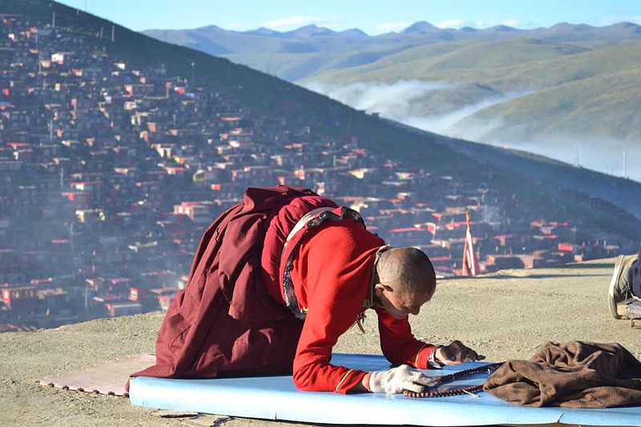
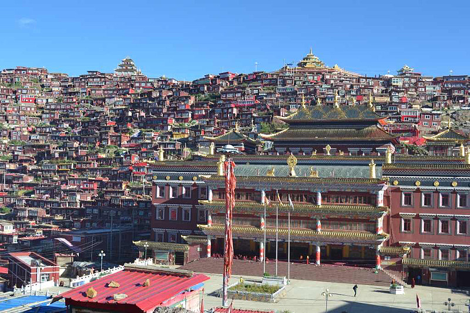
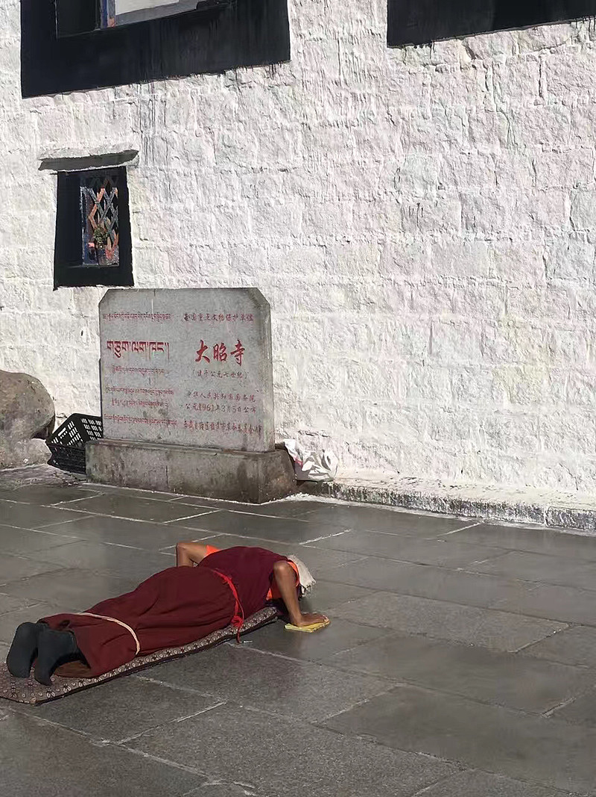
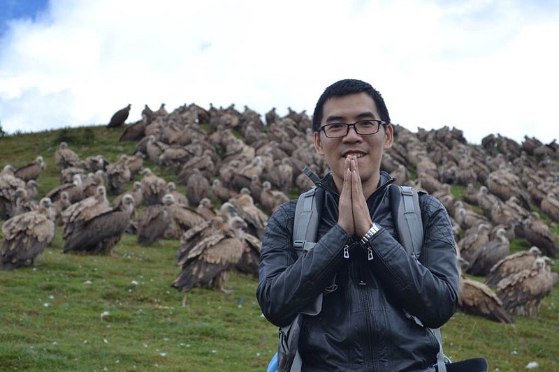
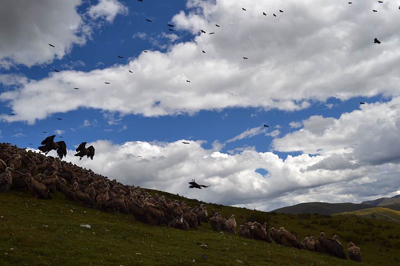
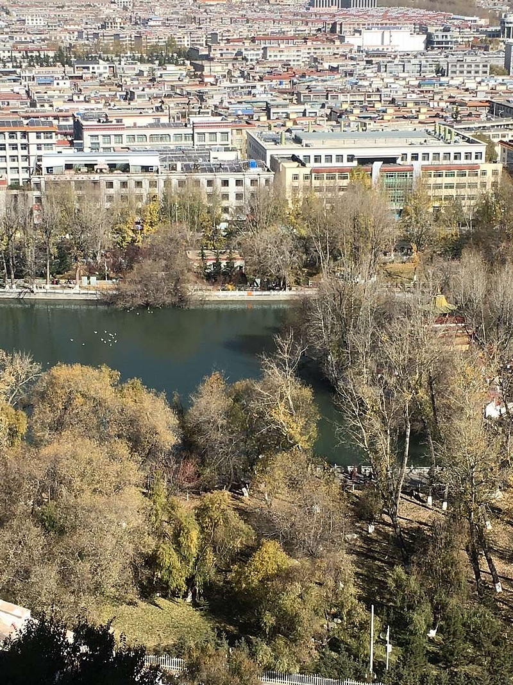
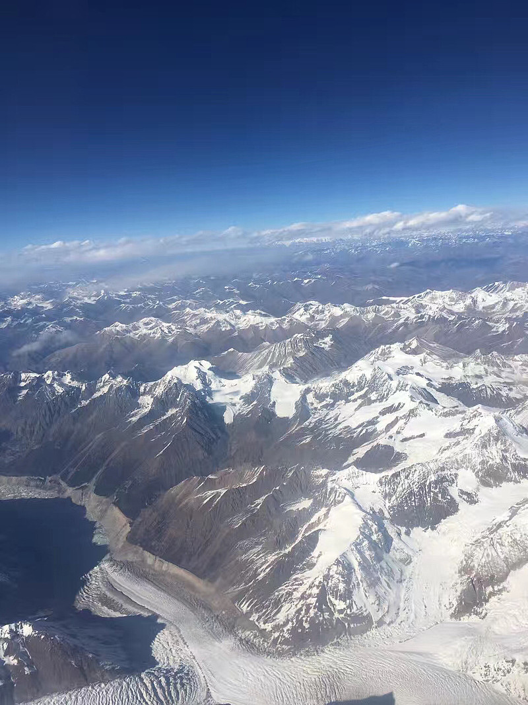
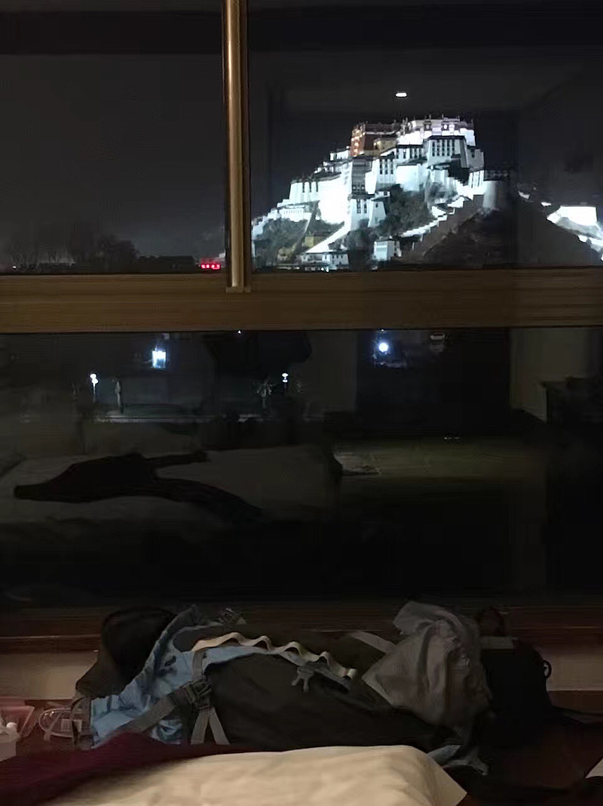

# 朝圣文化

> URL: https://xueqiu.com/4327270746/160395441

来源：雪球App，作者： 为霜，（https://xueqiu.com/4327270746/160395441）
我曾经两次进藏，一次是藏边的色达，一次是拉萨。沿途都看过很多这种藏民长途跋涉磕长头去朝圣的。应该这么说：从理性的角度出发，这种极度浪费时间的事情可能在不久之后就会越来越少看见了。因为社会的发展就是一个提高效率的问题。而事实是这种行为比起十年前已经少了很多很多。所以说，如果想体验更传统的藏区文化，要越早越好，不然会消失很快。但是，如果从感性的角度看，其实这种行为代表了一种精神与肉体的双重磨练。长远讲又是很有意义的。其实你可以看成是一次长途的荒野徒步旅行的加强版而已。就是徒步中参杂了磕头。很多人认为这些没意义，其实宏观说，人类的一切活动都是没有意义的。唯心灵的平衡罢了。人类一思考，上帝就发笑。你坐在电影院一动不动看2小时电影，不管你内心如何澎湃，在一只狗眼里就是一个盯着一块布看了2小时的傻叉。

人类社会的发展其实核心就是一个提高效率的问题。这种浪费一年，甚至更多时间的行为在未来世界会被视为极度奢侈的事情。除非真的智能化了，解放了人类的生产成本。但是那个时候，人类作为活体也没有什么意义了。
去拉萨，真的不要在夏季去，太多游客了。在十月底十一月初去是最好的，天气不算太冷，游客又少，可以看见大量大量农忙后朝圣的藏民，大昭寺一大片一大片磕头念经转经的的藏民。但是秋冬进藏空气质量不好。我翻阅过历任达赖的死亡描述，如果不算被害死的，几乎都有一个共同点就是胸痛，或者心痛。我参观过布达拉宫后觉得，这种胸痛很有可能就是胸积液，肺结核，因为布达拉宫的空气流通实在太差了。而且藏人的生活方式很容易传播肺结核。群居，不通风，经常磕头接触灰尘，风沙大缺乏植被等等。所以进藏最好带2个口罩。而且我觉得小孩子最有价值的疫苗就是卡介苗。
还有什么想说的，忘记了…
精神的力量在现代社会越来越匮乏了，因为时间就是金钱，在没有大量金钱之前追求精神力量是需要大量时间去思考去阅读去行走去信仰的。这些太浪费时间了。而精神的追求又是人类最高的顶级奢侈品。马云巴菲特这么有钱为啥还工作？因为人家需要用钱和时间来完成梦想。时间是用来实现与追求梦想的，不是用来赚钱的

