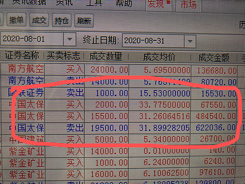

# 哑铃策略与黑天鹅——谈谈我目前的交易体系

> URL: https://xueqiu.com/4327270746/159314637

来源：雪球App，作者： 为霜，（https://xueqiu.com/4327270746/159314637）
昨夜失眠，翻了一些投资畅销书，翻到了塔勒布与他的黑天鹅，还有他的哑铃策略。（这些之前我没有系统了解过。）我惊讶的发现，这个人的交易哲学与我自己目前的交易体系不谋而合，惊人一致。
他认为，未来的世界是不确定性的，我们投资要在不确定性中保存自己，并且寻找机会。我深表认同，熟悉我的球友都知道，我对市场说的最多的一句就是“股市的明天是不确定性的。”而我与他不同的地方大概是他更悲观一些（资产配置80%是零风险，20%是高风险）而我自己则认为，市场短期是不确定性的，但是时间轴拉长了看，人类社会经济总量的增长是确定的。所以，我的组合大量使用了杠杆。
下面我具体谈谈
我把组合的资产分为三块，左边的是重仓长期持有的成长类股票，紫金矿业与华东医药。这两支股票在我的交易体系中是长期持有并且不会因为市场波动而随意加减仓位的（基本面变化例外）。这就是择股。右边是一支高分红稳定的相对活跃的惰性股票，中国太保。它的作用是做网格，锁定收益用的。中间就是现金，根据市场情况变化持有现金的仓位。这就是择时。左边和右边就组成了一个系统风险不同的哑铃。基本也可以看成是一个股市内的哑铃策略。
具体说一下这个策略的应用。
大盘无外乎有三种情况，上涨，下跌，震荡。
如果大盘上涨了，我手上的股票全部获利，这时候，我会用右边的中国太保做网格，不断卖出锁定收益。如果全部卖出后，大盘继续上涨。我会持有现金不动，等待大盘回调重新调整网格标的。这样做，就算大盘一直上涨，但是我扔有2支重仓股票可以获得很好利益，不会踏空。
如果大盘不是上涨，而是震荡，它涨着涨着就回调了。那我右边的中国太保依然可以用网格交易来锁定利润，而不至于因为大盘长期震荡而一无所有。
如果大盘是一个趋势下跌，那这时候，我的现金就派上用场。会根据市场情况越跌越买，直到打完全部子弹。（当然，现金是有限的，如果真的是股灾，触及到爆仓，资产清零，那只能依靠场外补充现金平掉杠杆了。）
这样，我们就可以看到这个组合，无论大盘上涨，下跌，还是震荡，我都可以比较好的保护自己的同时最大化的获得利润。
我在上一张图

大家可以看到，8月份是一个震荡市，我获利24万，其中 就依靠中国太保的交易锁定了7万元。
这样说 大家是不是比较能理解 什么叫利用市场的不确定性与哑铃策略了？
 $中国太保(SH601601)$