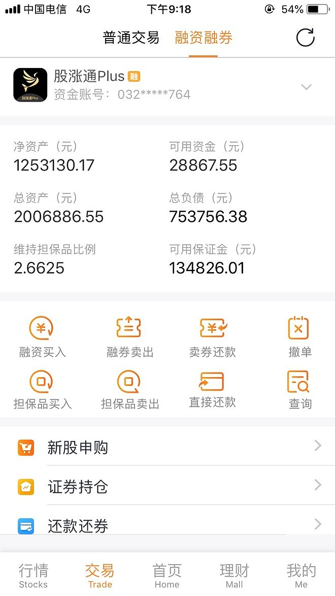
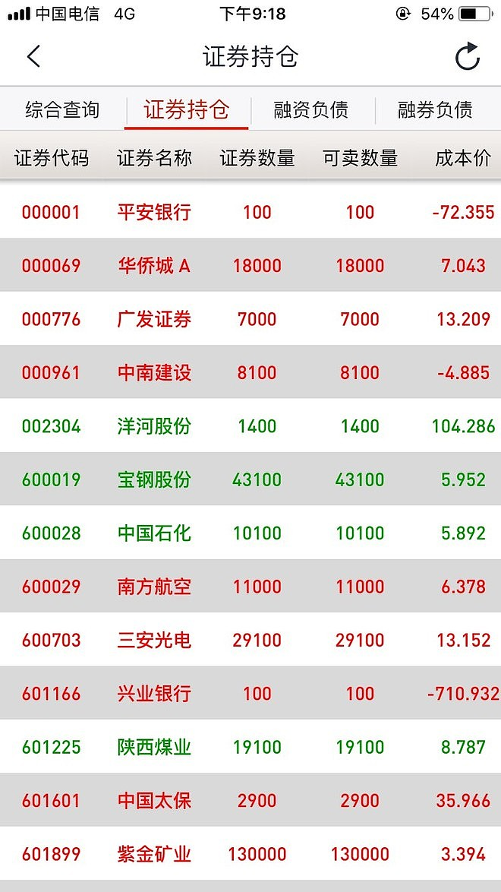
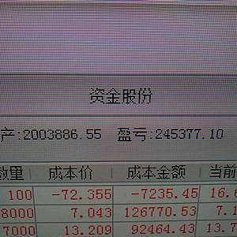

# 凯旋

> URL: https://xueqiu.com/4327270746/135492924

来源：雪球App，作者： 为霜，（https://xueqiu.com/4327270746/135492924）
不知不觉，来到雪球已经两年半了。这两年 由青涩呆萌，变成了现在的老奸巨猾。是雪球让我快速的成长起来。
如果由开始就关注我的朋友就应该知道，最近我的投资风格发生了重大转变。刚来雪球的时候，我的策略是用高杠杆集中买入低估稳定的具有一定成长性的银行股（兴业银行）。希望通过低估稳定成长获得利润，同时通过杠杆放大这份利润。现在回头看，这个策略还是非常成功的，尤其适合当初懵懂不经世事的初级投资者（我）。
不过随着对中国股市的理解，我发现这个策略有两个重大的问题，第一 就是你不可能真正读懂一家公司，尤其是一家银行。第二 随着本金的扩大，要保持收益率就必须同步放大自己的场外杠杆，而这个风险是会成指数增加的，除非你降杠杆。但是降杠杆的话，你的收益率又会跟不上。所以，这个办法只是适合股市初始资金约等于0的时候尤其适用。
在最近半年，我开始尝试转变风格，希望通过高频交易来增加资金利用率同时提高收益率。在九月份，兴业银行出了一份让人作呕的中报。这彻底让我放弃了之前的策略。决定用低估分散与小仓位高频交易来降低风险，降低资本要求同时提高收益率。但是这种方法，他的风险敞口是比第一种策略要高很多的。为了应对未知的风险，降低风险敞口，我把账户彻底清空了。把本金拿出来，一部分用以偿还之前的场外杠杆。（因为用策略2并不需要太多的本金。）同时，把剩下的钱分拆成两个账户：一个是普通账户，通过港股通买入了工商银行，建设银行，中国石化，兖州煤业与紫金矿业5支股票。目的就是长期持有吃股息。万一我的策略失败了，这个账户的股息也能保证我可以很好的生活下去，不至于被生活逼迫的过于狼狈。而剩下的100万，我就打算放开手脚，在大A赌个酣畅淋漓。
经过两个月的操作，运气不错，赚了20多万。所以大家最近经常看我贴实盘交易，天天嘚瑟市值新高云云。但是方老板说过，没有经过第三方证明的吹嘘都是耍流氓。为了证明自己不是流氓，我决定了开实盘。
为什么要开实盘？其实我也没有想太清楚，不过实盘带来的压力会是什么效果我却很清楚？是装B成功，鞭策成长还是被无情鞭笞得头破血流心态失衡狼狈不堪呢？我不知道，我只知道这是一个挑战。至少他会让我目前平淡如白开水一般的生活有了一些波澜。或者这仅仅是为了打发无聊，或者只是为了证明自己存在过......
这是一个展示贴，并不是一个教育贴。所以，如果你们有看不懂的也不要问我为什么。因为买卖本来就是很主观的东西，原因或者仅仅是因为内心一丝的不安而已。所以，我也不知道怎么回答你。就让我自己安静的在这里装B，你们安静的在围观就可以。不被打扰的相逢或者就是彼此最好的选择。
以后关于股市的东西都会在这个帖子说了，不在开贴浪费资源。

